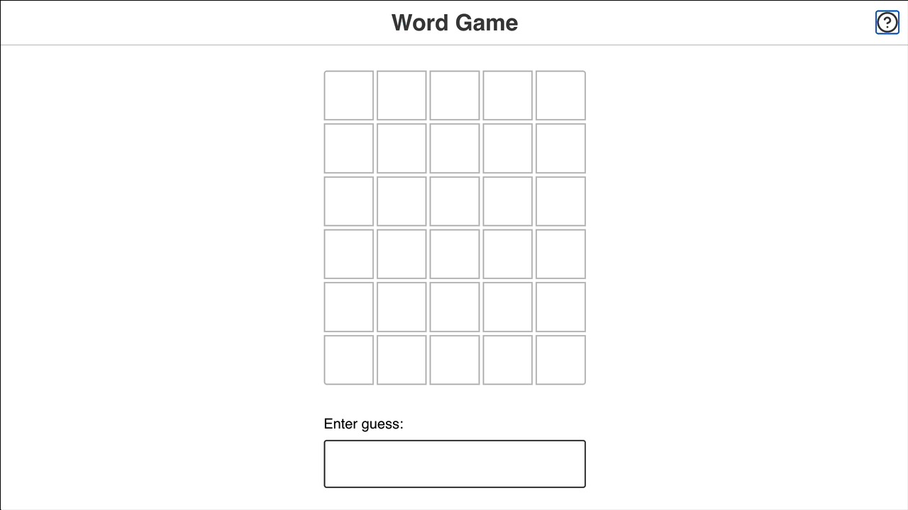

# Wordle Clone

A recreation of the popular word-guessing game built with React.



## About

Players have 6 attempts to guess a 5-letter word. After each guess, letters are color-coded to help narrow down the answer:

- 🟩 **Green** — correct letter in the correct position
- 🟨 **Yellow** — correct letter in the wrong position
- ⬜ **Gray** — letter not in the word

## Features

- Interactive game board with 6×5 grid
- Real-time input validation (5-letter words only)
- Color-coded feedback after each guess
- On-screen keyboard with letter status tracking
- Win/lose detection with game-over banner
- Restart functionality for unlimited replays

## Tech Stack

- React
- Parcel
- CSS

## Getting Started

```bash
npm install
npm run dev
```

## Live Demo

[Play the game →](#)
